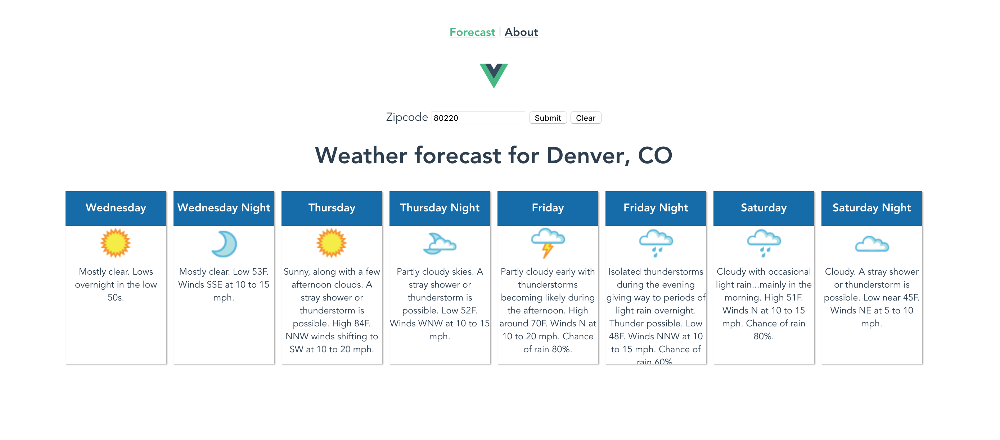

# vue-weather
Simple weather app to match my react-weather and ng2-es6-weather samples

# Getting Started
First, install the required node packages with npm: 

`npm install`

## Weather Underground API key
You must obtain a free key from //www.wunderground.com/weather/api/

Create a .env.local file, using .env as a template

`npm start`

